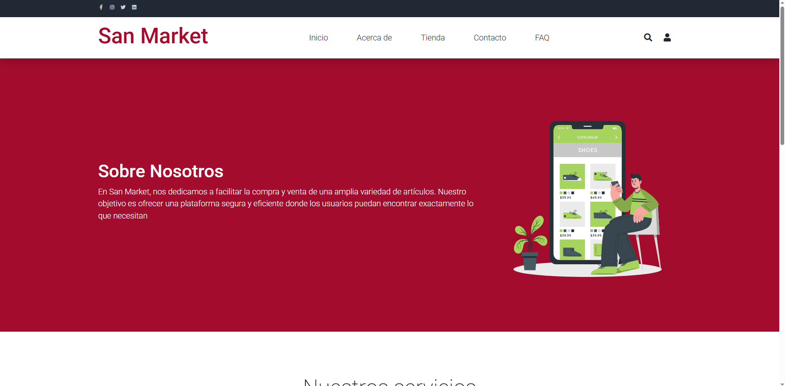
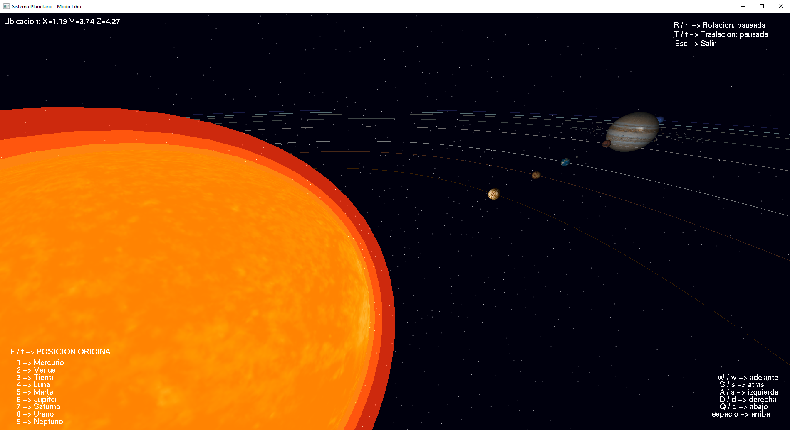

<h1 align="center">Hola, soy <a href="https://github.com/LeoNato04">Leonel Fortunato</a> 👋</h1>

<em>Transformo ciencia, datos y tecnología en soluciones visuales e interactivas.</em>

## Sobre mí

- 🎓 Estudiante de Computación Científica en la UNMSM  
- 💻 Desarrollo simuladores científicos y educativos con **OpenGL en C++**  
- 🌐 Apasionado por la visualización interactiva de datos y sistemas complejos  
- 📊 He trabajado con modelos como **Predador-Presa**, **Romeo y Julieta**, **Lorenz**, y **Tuberculosis**  
- 🛍️ Creador de **SanMarket**, una plataforma de apoyo a emprendedores universitarios  
- 🧠 Interesado en **Inteligencia Artificial**, **gráficos por computadora**, y **modelamiento numérico**

---

## 🧰 Tecnologías y herramientas que uso

  
| Lenguajes        | Tecnologías / Librerías              | Otras herramientas         |
|------------------|--------------------------------------|----------------------------|
|  | OpenGL, FreeGLUT, GLM        | Git, GitHub |
|  | NumPy, Matplotlib, ODEINT   | LaTeX, Chart.js |
|  | HTML, CSS, Firebase         | Code::Blocks, VSCode |
|  | Jetpack Compose (aprendiendo) | Canva, OBS Studio |

---

## 📁 Repositorios interesantes

### 🔬 SanMarket  
  
Plataforma de apoyo a microempresarios universitarios (Firebase, JS, HTML/CSS).

---

## Proyectos destacados

<table>
<tr>
<td width="50%">
<h3 align="center">SanMarket</h3>

Una plataforma web que impulsa a estudiantes a publicar y gestionar sus microempresas universitarias. Incluye registro, carrito de compras, mensajería, y más.

</td>

<td width="50%">
<h3 align="center">Visualizador 3D del sistema digestivo</h3>

Visualizador anatómico interactivo en C++ y OpenGL. Modo libre e interfaz, sprites informativos, rotación automática y exploración detallada.

</td>
</tr>
</table>

---

<table>
<tr>
<td width="50%">
<h3 align="center">Simulador del Sistema Solar</h3>

Una simulación del sistema solar en 3D con órbitas, rotaciones reales y enfoque automático con teclas. Compatible con exploración libre.

</td>

<td width="50%">
<h3 align="center">Modelo Epidemiológico TB</h3>

Modelo de tuberculosis en Pakistán con visualización interactiva: sliders, gráficos y mapa animado. Hecho con Chart.js, Python y JavaScript.

</td>
</tr>
</table>

